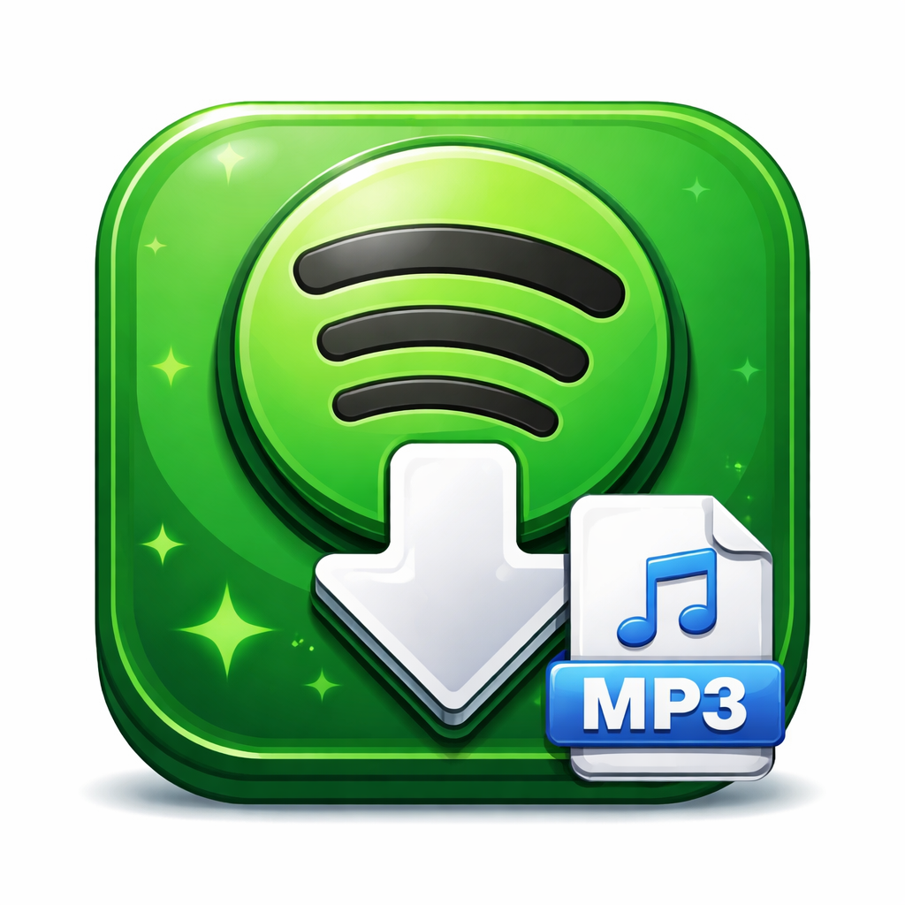

<div align="center">



# 🎵 Spotify MP3 Downloader

**Paste a Spotify playlist, album or track link — download with one click.**

[](https://github.com/slckgms/spotify-mp3-downloader/releases/latest)
[](https://github.com/slckgms/spotify-mp3-downloader/releases/latest)
[](https://github.com/slckgms/spotify-mp3-downloader/releases/latest)
[](LICENSE)

[⬇️ **DOWNLOAD**](https://github.com/slckgms/spotify-mp3-downloader/releases/latest) &nbsp;•&nbsp; [🐛 Report Bug](https://github.com/slckgms/spotify-mp3-downloader/issues) &nbsp;•&nbsp; [💡 Suggest Feature](mailto:spotifymp3app@gmail.com)

</div>

---

## ✨ Features

| Feature | Details |
|---|---|
| 🎵 **Playlist support** | Unlimited tracks — even 500+ song playlists |
| 💿 **Album download** | Download full albums in one click |
| 🎶 **Single track** | Direct track links work too |
| 🎚️ **9 Formats** | MP3, FLAC, WAV, M4A, OGG, OPUS, AAC, AIFF, ALAC |
| ⭐ **Up to 320 kbps** | High quality audio |
| 🏷️ **Auto metadata** | Title, artist, album info embedded automatically |
| 🖼️ **Cover art** | Automatically embedded for MP3 and M4A |
| 🌐 **12 Languages** | EN, TR, DE, RU, ZH, ES, FR, PT, AR, JA, KO, IT |
| 📡 **Auto-retry** | Pauses on disconnect, resumes when internet returns |
| 📦 **All-in-one setup** | ffmpeg included — nothing else to install |

---

## ⬇️ Installation

### Quick Install (Recommended)

1. Click the download button below
2. Run `SpotifyMP3_Setup.exe`
3. Follow the installer: **Next → Install → Finish**

<div align="center">

[](https://github.com/slckgms/spotify-mp3-downloader/releases/latest)

</div>

> **Windows Defender warning?** Click "More info" → "Run anyway". This is normal for unsigned indie software.

---

## 🚀 How to Use

```
1. Open a playlist / album / track on Spotify
2. Share → Copy Link
3. Paste the link into the app (Ctrl+V or right-click → Paste)
4. Click "Fetch" — track list loads automatically
5. Choose your format and quality
6. Click "Download" 🎉
```

### Supported Link Types
```
https://open.spotify.com/playlist/...
https://open.spotify.com/album/...
https://open.spotify.com/track/...
```

---

## 🔧 How It Works

The app **does not use the Spotify API**. Here's the flow:

```
Spotify link  →  Fetches track names + artists
                          ↓
               Searches on YouTube Music
                          ↓
               Downloads the best match
                          ↓
               Converts to your chosen format via ffmpeg
```

This means:
- ✅ No Spotify account needed
- ✅ No API keys or rate limits
- ✅ YouTube Music audio quality

---

## 📦 What's Inside the Installer?

After setup, you get:

| File | Description |
|---|---|
| `SpotifyMP3.exe` | Main app (Python + yt-dlp + Pillow bundled) |
| `ffmpeg/` | Audio converter — no separate install needed |
| `README.txt` | Usage guide in your install language |

---

## ❓ FAQ

<details>
<summary><b>Is it safe? Windows Defender flagged it.</b></summary>

Yes, it's safe. The warning appears because the app is unsigned indie software. Click "More info" → "Run anyway". Feel free to open an issue if you have concerns.
</details>

<details>
<summary><b>Why is downloading slow?</b></summary>

Each track requires a YouTube Music search + download. Average is 15–30 seconds per track depending on your internet speed.
</details>

<details>
<summary><b>Some tracks failed — why?</b></summary>

Rare tracks not available on YouTube Music may fail. Failed tracks are saved to `failed_tracks.txt` in your download folder.
</details>

<details>
<summary><b>Does it support playlists with 100+ tracks?</b></summary>

Yes! The app uses a custom method to bypass Spotify's 100-track embed limit. Tested with 500+ song playlists.
</details>

<details>
<summary><b>Mac or Linux support?</b></summary>

Windows 10/11 only for now. Mac/Linux may be considered in a future release.
</details>

<details>
<summary><b>Does it need a Spotify account?</b></summary>

No. The app only reads public playlist/album/track information. No login required.
</details>

---

## ☕ Support

If you find this app useful, you can buy me a coffee:

<div align="center">

**USDT TRC-20 (Tron Network)**
```
TEJPv2oUN8Cw8fhGoej5mFhCD8nve3xGMd
```

*Every contribution keeps the project alive. Thank you! 🙏*

</div>

---

## 📬 Contact & Feedback

- 📧 **Email:** [spotifymp3app@gmail.com](mailto:spotifymp3app@gmail.com)
- 🐛 **Bug reports:** [GitHub Issues](https://github.com/slckgms/spotify-mp3-downloader/issues)
- ⭐ **Like the project?** Leave a star — it helps a lot!

---

## ⚠️ Disclaimer

This software is intended for **personal use only**. Downloaded content remains the property of its respective copyright holders. Commercial use is strictly prohibited. The app sources audio from YouTube Music and has no direct affiliation with Spotify.

---

<div align="center">

If this helped you, please consider giving it a ⭐ **star** — it means a lot!

</div>
